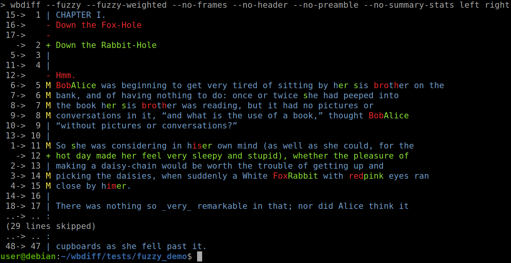

# `wbdiff` - Advanced diff utility

Diffing tool with few sophisticated features, hopefully makeing developer's life
easier.

Example output:

```
$ ./wbdiff tests/9/left tests/9/right
Removals from left file, moves and additions to right file:
--- tests/9/left
+++ tests/9/right
---------\ l0017-l0022 -> r0001-r0006  (5 lines)
 17->  1 | q
 18->  2 | r
 19->  3 | s
 20->  4 | t
 21->  5 | v
---------/
---------\ l0009-l0014 -> r0006-r0011  (5 lines)
  9->  6 | i
 10->  7 | j
 11->  8 | k
 12->  9 | l
 13-> 10 | m
---------/
   -> 11 + A
   -> 12 + E
---------\ l0001-l0009 -> r0013-r0021  (8 lines)
  1-> 13 | a
  2-> 14 | b
  3-> 15 | c
  4-> 16 | d
  5-> 17 | e
  6-> 18 | f
  7-> 19 | g
  8-> 20 | h
---------/
---------\ l0014-l0017 -> r0021-r0024  (3 lines)
 14-> 21 | n
 15-> 22 | o
 16-> 23 | p
---------/

Diff statistics:
	Initial context length used: 3
	Number of matching (extended) blocks: 4
	Number of lines in matching (extended) blocks: 21
	Number of lines removed from left file: 0
	Number of new lines added to right file: 2
	Weighted cost (blocks + removed + added): 5
```

Or in colors:



Please notice, the line number in the left most column, and how `wbdiff` maps
them to the right column, detecting block moves, additions, removals, while some
blocks have minor edits in them.

## Features:

  - Detection of moved code blocks
  - Fuzzy matching on both block and line level
  - Adaptative moved blocks and fuzzy matching
  - Shortening of long blocks
  - Color output
  - Statistics at the end of diff output
  - Support for reading compressed files transparently (.gz, .bz2)
  - Ability to ignore certain types of changes
  - Normalization of lines
  - Diff algorithm and output tunable using command line options
  - `git` integration support
  - Tested by more than dozen of unittests
  - Slowness

## TODO:

  - Splited/merged lines detection
  - Recursive diffing of multiple files/directories
  - Speed optimizations

## History

This tool was created on one evening, when I was utterly annoyed by lack of good
diff tools. I checked about 15 of them, and actually Microsoft's free version
WinDiff was best (running in WINE)! However, I wanted simple tool, with ability
to work from command line natively on Linux, and more possible customizations.
Then in few hours I created wbdiff.py :) Works perfectly for me, producing
optimal diffs.

Copyright: Witold Baryluk, 2013, 2021
